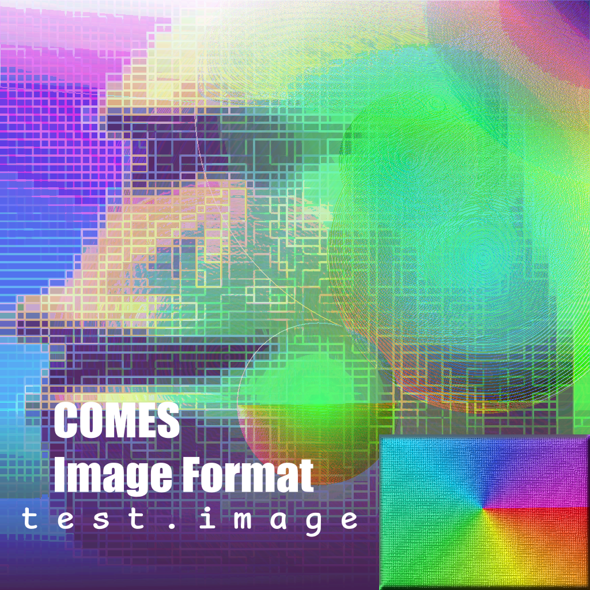

# CIF decoder tests



This repository contains various tests for compliance with the CIF specification.

## How to use these tests

The tests are split into the following groups:
- `valid` - images that are valid and should be decoded without problems
- `invalid` - images that are not valid and should cause the parser to exit with a non-zero code
  (but not a signal)

Additionally, there's a `generators` directory in which the scripts used to generate these test
images are stored.

## Compliance

For a decoder/encoder to be standards-compliant, all tests must pass and its source code must be
audited. Compliance is measured using three different levels:
- **Gold** - the decoder is eligible for Silver rating and [@liquidev][liquidev] audited that the
  decoder's source code does not contain any hacks that aim to work around the test suite.
- **Silver** - the decoder passed all `valid` and all `invalid` tests.
- **Bronze** - the decoder passed all `valid` tests, but not all `invalid` tests.

If a decoder does not qualify for any of the above, it is not standards-compliant.

   [liquidev]: https://github.com/liquidev

## Automating tests

The script `test-runner.py` can be used to automate running tests.

```
# To classify for Bronze or Silver:
$ python3 test-runner.py <decoder args...>
```

## Large files

Names of CIF files whose size exceeds 100 KiB should are with `.large.cif`. These files are tracked
using Git Large File Storage (LFS) so as to avoid increasing the size of the repository
substantially.
